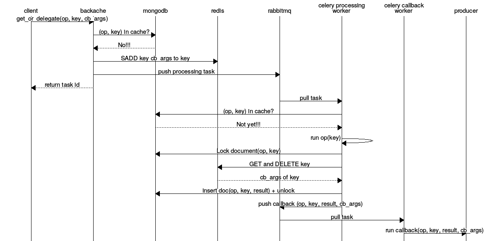
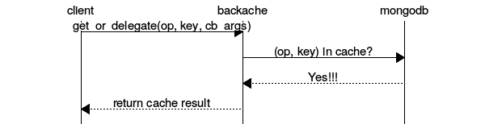
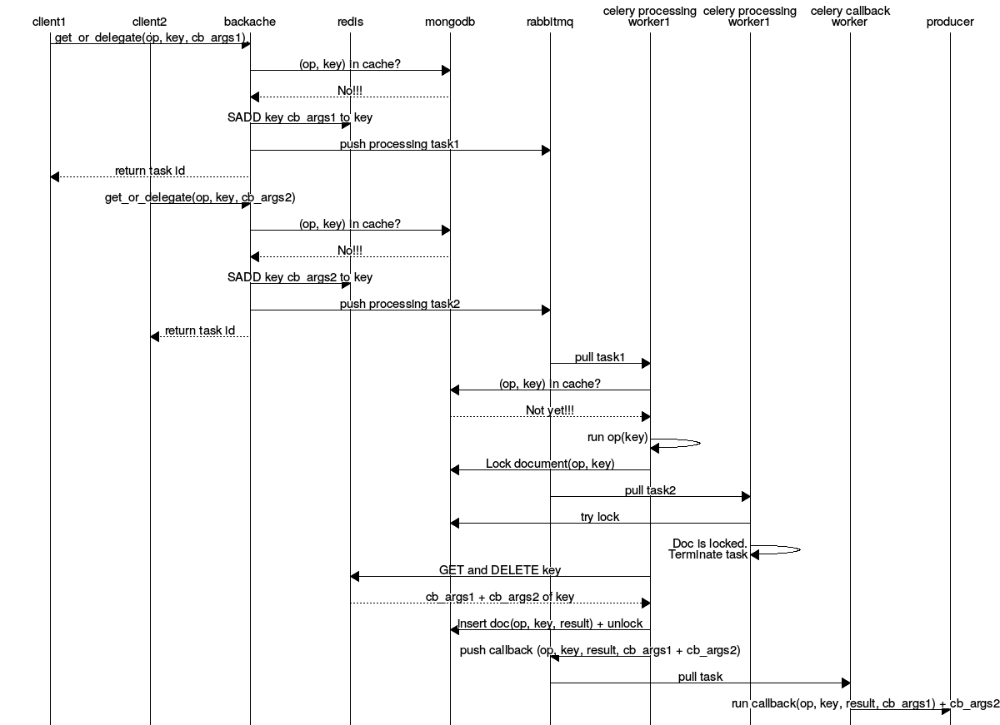

# Backache

[](http://badge.fury.io/py/backache)
[](https://travis-ci.org/cogniteev/backache)
[](https://coveralls.io/github/cogniteev/backache?branch=master)
[](https://codeclimate.com/github/cogniteev/backache)
[](https://landscape.io/github/cogniteev/backache/master)

Backache is a Python module providing an asynchronous URI processing library.
Processing of your resources is made once and then stored in a cache, to speed
up identical queries in the future.

The processing itself is made asynchronously, and your consumers are spawned
when awaited processing is finished.

Default backends:

* Asynchronous processing: [Celery](http://celery.readthedocs.org/)
* Document cache: [MongoDB](https://www.mongodb.org/)
* Processing queue: [Redis](http://redis.io/)

# How it works

Assuming that you use RabbitMQ as message broker for Celery, here is what
the processing of `key` with `op` operation looks like. `cb_args` are
arguments that will be given to the callback dealing with the
processing result.

## Cache miss
Here is what happens when the result of the `op` operation for the given
`key` is not yet in the cache.


With the `task_id` returned, the client is able to wait for the end of the
callback processing.

## Cache hit
The following diagram describes what happens when processing of `key` by the
`op` operation already in the cache.



In this case, processing result is not sent to a delayed task but returned
immediately to the client. Why doing that? Because in many situations,
the client very well knows what to do with it, and in most situations, delay
the result processing is less efficient.

## Twice for the same price

According to the kind of data you deal with, the time window during which
two clients want to process an unknown resource is more or less large.
In such situation, Backache tries to bulk the two requests in one single
callback operation.



The situation is quite idealistic, but is more an optimization than a real
breakthrough. But it raises a question:

**Why isn't the operation executed inside the lock?**

And this leads to the next *missing* section ... URI redirections.

# Installation

```shell
$ pip install backache
```

# Tests

Use `tox` to run the tests-suite on every supported platform:

```shell
# Install and load virtualenv
$ pip install virtualenv
$ virtualenv .env
$ . .env/bin/activate
# Install tox
$ pip install tox
# Run the test suites
$ tox
```

The test-suite requires MongoDB 2.6 and Redis to be up and running.

# License

Backache is licensed under the Apache License, Version 2.0.
See [LICENSE](LICENSE) file for full license text.
